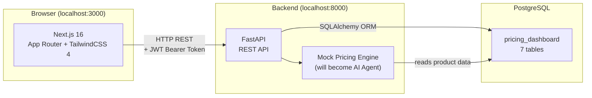
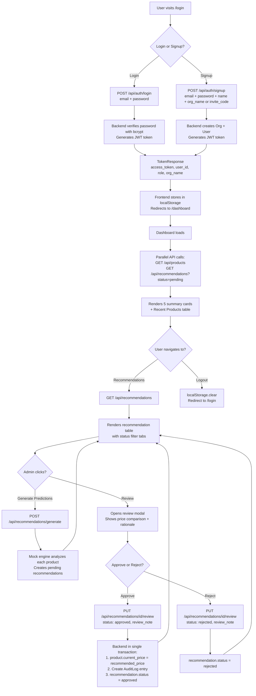
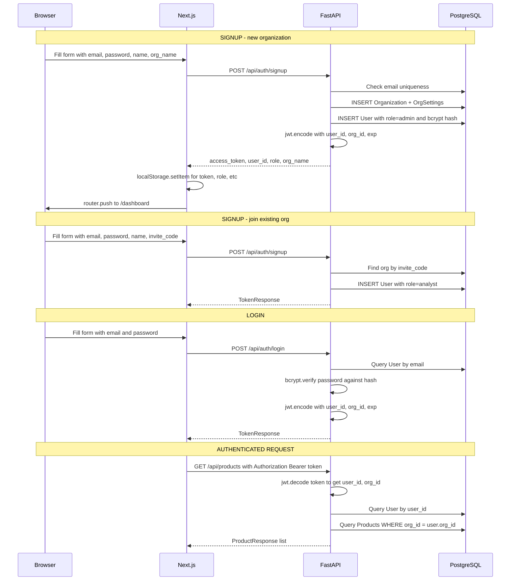
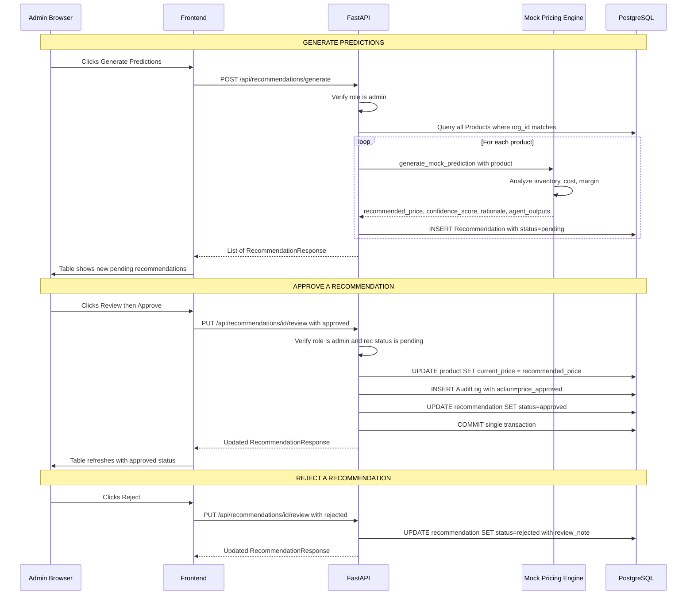
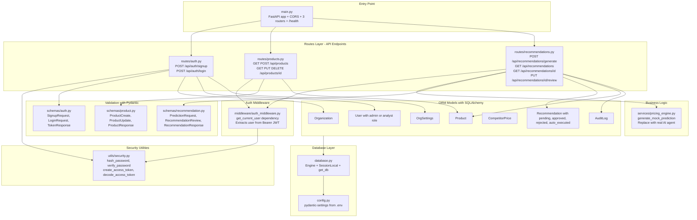
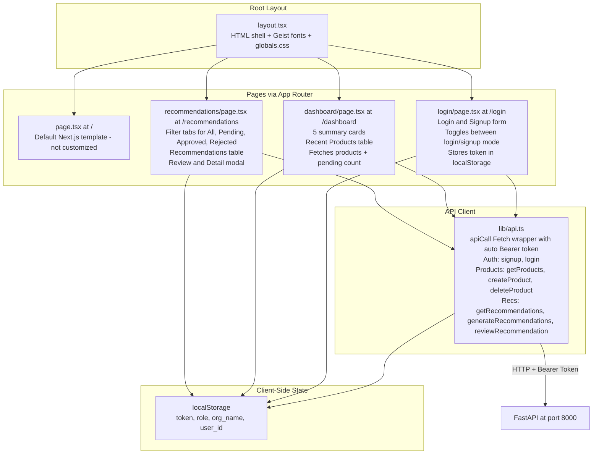
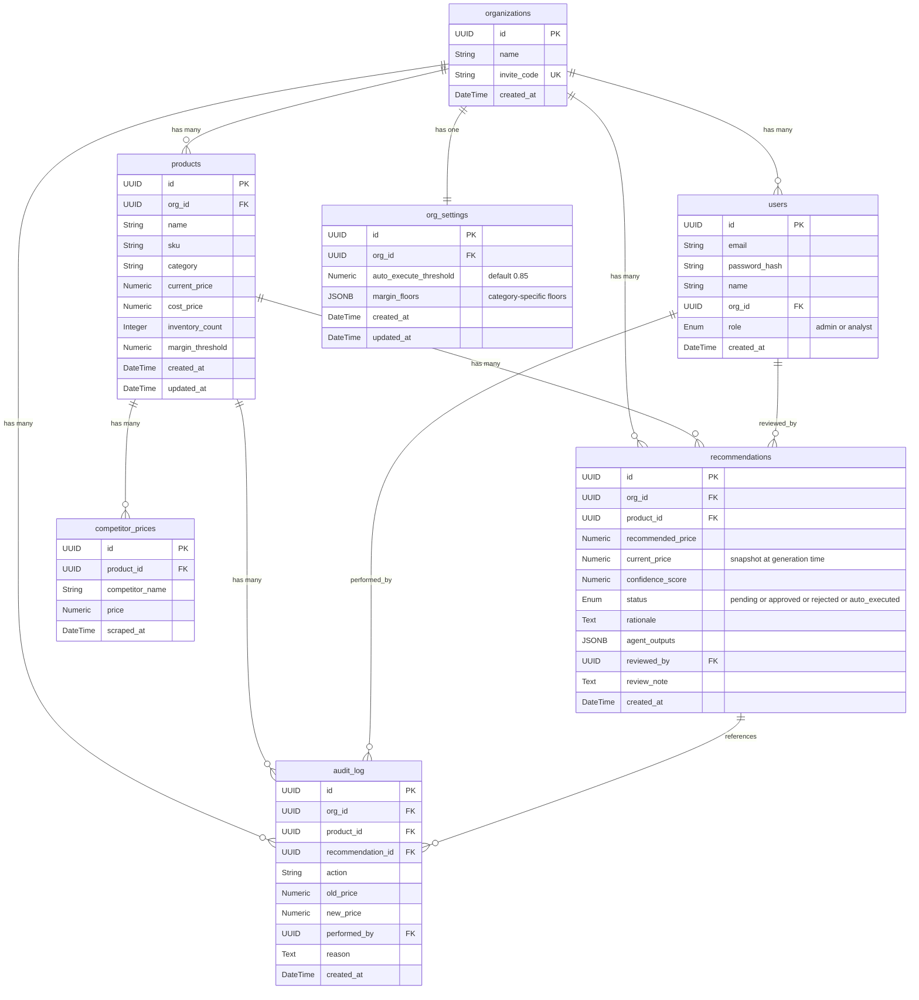
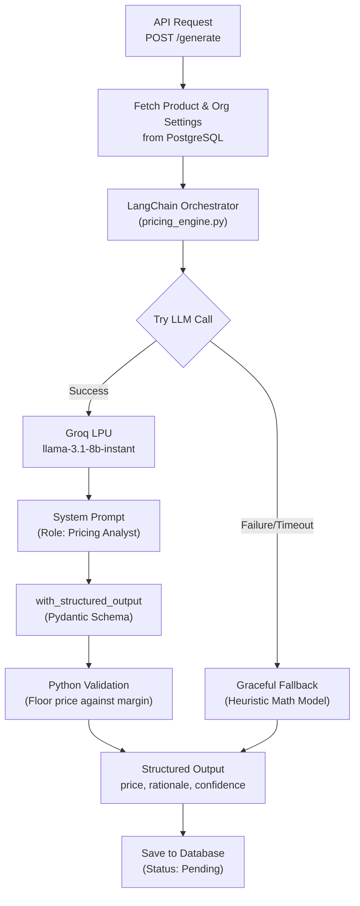
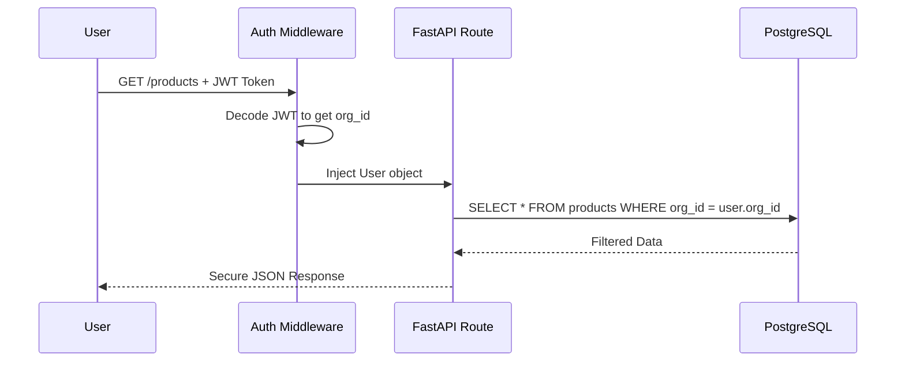

# Klypup Project — Complete Documentation

> **Dynamic Pricing Intelligence Dashboard**
> A full-stack, multi-tenant SaaS platform where an AI engine analyzes products and generates pricing recommendations, which admins review (approve/reject) through a human-in-the-loop workflow. On approval, the product price updates automatically and an audit trail is created.

---

## 1. Tech Stack

| Layer | Technology | Version |
|-------|-----------|---------|
| **Backend API** | FastAPI (Python) | ≥ 0.104 |
| **Database** | PostgreSQL | — |
| **ORM** | SQLAlchemy 2.0 (Declarative) | ≥ 2.0 |
| **Migrations** | Alembic | ≥ 1.12 |
| **Auth** | JWT (python-jose) + bcrypt (passlib) | — |
| **Config** | pydantic-settings (.env) | ≥ 2.0 |
| **Frontend** | Next.js 16 (App Router) | 16.2.6 |
| **UI** | React 19 + TailwindCSS 4 | — |
| **AI (planned)** | LangChain + Groq | In requirements, mock for now |
| **Orchestration (planned)** | Temporal | Scaffolded, not implemented |

---

## 2. High-Level System Architecture



---

## 3. What Has Been Built — Feature Map

### Feature 1: Authentication & Multi-Tenancy

- **Signup** — Create a new user + organization (admin) or join existing org via invite code (analyst)
- **Login** — Email + password → JWT token
- **JWT middleware** — Every protected route extracts user from Bearer token
- **Role-based access** — `admin` can write (create/update/delete products, generate & review recommendations); `analyst` can only read
- **Multi-tenant isolation** — All queries filter by `user.org_id` so each organization sees only its own data

### Feature 2: Product Management (CRUD)

- **List products** — All products for the user's organization
- **Create product** — Admin only (name, SKU, category, price, cost, inventory, margin threshold)
- **Get single product** — By ID (org-scoped)
- **Update product** — Admin only, partial updates
- **Delete product** — Admin only

### Feature 3: AI Price Recommendations + Human-in-the-Loop Approval

- **Generate predictions** — Triggers the mock pricing engine for all products (or a single one). Creates `pending` recommendations
- **List recommendations** — With optional status filter (`?status=pending|approved|rejected`)
- **Review modal** — Shows price comparison, % change, confidence score, AI rationale, and agent analysis JSON
- **Approve** — Updates product price to recommended price, creates audit log entry, marks recommendation as approved
- **Reject** — Marks recommendation as rejected with review note

### Supporting Infrastructure

- **Seed data** — 2 orgs (TechCorp, RetailHub), 3 users, 11 products pre-loaded
- **Alembic migration** — Single migration creating all 7 tables
- **Health check** — `GET /health` → `{"status": "Ok"}`

---

## 4. Complete Application Flow



---

## 5. Auth Flow — Sequence Diagram



---

## 6. Recommendation + Approval Flow — Sequence Diagram



---

## 7. Backend — Component-Level Architecture



---

## 8. Frontend — Component-Level Architecture



---

## 9. Database Schema — ER Diagram



---

## 10. API Endpoints — Complete Reference

| Method | Endpoint | Auth | Role | Description |
|--------|----------|------|------|-------------|
| `GET` | `/health` | No | — | Health check |
| `POST` | `/api/auth/signup` | No | — | Register user + create/join org |
| `POST` | `/api/auth/login` | No | — | Login and get JWT token |
| `GET` | `/api/products/` | Yes | All | List org products |
| `POST` | `/api/products/` | Yes | Admin | Create product |
| `GET` | `/api/products/{id}` | Yes | All | Get single product |
| `PUT` | `/api/products/{id}` | Yes | Admin | Update product partially |
| `DELETE` | `/api/products/{id}` | Yes | Admin | Delete product |
| `POST` | `/api/recommendations/generate` | Yes | Admin | Generate mock AI predictions |
| `GET` | `/api/recommendations/` | Yes | All | List recommendations with optional status filter |
| `GET` | `/api/recommendations/{id}` | Yes | All | Get single recommendation |
| `PUT` | `/api/recommendations/{id}/review` | Yes | Admin | Approve or reject a recommendation |

---

## 11. Directory Structure

```
Klypup_project/
├── backend/
│   ├── .env                          # DATABASE_URL, JWT_SECRET, GROQ_API_KEY
│   ├── requirements.txt              # Python dependencies
│   ├── alembic.ini                   # Alembic config
│   ├── alembic/
│   │   ├── env.py                    # Imports all models for autogenerate
│   │   └── versions/
│   │       └── 17613b87962d_create_all_tables.py
│   ├── app/
│   │   ├── __init__.py
│   │   ├── main.py                   # FastAPI app + CORS + 3 routers
│   │   ├── config.py                 # Settings from .env via pydantic-settings
│   │   ├── database.py               # SQLAlchemy engine + session + get_db
│   │   ├── models/
│   │   │   ├── organization.py       # Organization with id, name, invite_code
│   │   │   ├── user.py               # User with email, password_hash, role, org_id
│   │   │   ├── product.py            # Product with name, sku, category, prices, inventory
│   │   │   ├── recommendation.py     # Recommendation with recommended_price, confidence, status
│   │   │   ├── competitor_price.py   # CompetitorPrice with competitor_name, price
│   │   │   ├── audit_log.py          # AuditLog with action, old_price, new_price
│   │   │   └── org_settings.py       # OrgSettings with auto_execute_threshold, margin_floors
│   │   ├── schemas/
│   │   │   ├── auth.py               # SignupRequest, LoginRequest, TokenResponse
│   │   │   ├── product.py            # ProductCreate, ProductUpdate, ProductResponse
│   │   │   └── recommendation.py     # PredictionRequest, RecommendationReview, RecommendationResponse
│   │   ├── routes/
│   │   │   ├── auth.py               # POST /signup, /login
│   │   │   ├── products.py           # CRUD /api/products
│   │   │   └── recommendations.py    # /generate, list, get, /review
│   │   ├── services/
│   │   │   └── pricing_engine.py     # Mock engine - swap for real AI agent
│   │   ├── middleware/
│   │   │   └── auth_middleware.py     # get_current_user JWT dependency
│   │   └── utils/
│   │       └── security.py           # hash, verify, JWT encode/decode
│   ├── scripts/
│   │   ├── seed_data.py              # Seeds 2 orgs, 3 users, 11 products
│   │   └── verify_approval.py        # DB verification script
│   └── temporal/                     # Scaffolded only, directories are empty
│       ├── activities/
│       └── workflows/
│
└── frontend/
    ├── package.json                  # Next.js 16, React 19, TailwindCSS 4
    ├── next.config.ts
    ├── tsconfig.json
    └── src/
        ├── lib/
        │   └── api.ts                # Fetch wrapper + 8 API functions
        └── app/
            ├── layout.tsx            # Root layout with Geist fonts
            ├── globals.css           # Tailwind + theme variables
            ├── page.tsx              # Landing page, default Next.js template
            ├── login/
            │   └── page.tsx          # Login and Signup form
            ├── dashboard/
            │   └── page.tsx          # 5 summary cards + products table
            └── recommendations/
                └── page.tsx          # Filter tabs + recommendations table + review modal
```

---

## 12. AI Orchestration Flow

The core intelligence is powered by LangChain and Groq (`llama-3.1-8b-instant`), utilizing Structured Output to guarantee safe, parseable responses.



---

## 13. Seed Data — Pre-loaded

| Organization | Invite Code | Admin User | Analyst User | Products |
|---|---|---|---|---|
| **TechCorp** | `TECH2026` | admin@techcorp.com / admin123 | analyst@techcorp.com / analyst123 | 8 products |
| **RetailHub** | `RETAIL26` | admin@retailhub.com / admin123 | — | 3 products |

### TechCorp Products

| Product | SKU | Category | Price | Cost | Stock |
|---|---|---|---|---|---|
| Sony WH-1000XM5 | SONY-WH1000 | electronics | 24,990 | 18,000 | 150 |
| Samsung Galaxy S24 | SAM-S24 | electronics | 79,999 | 55,000 | 80 |
| Nike Air Max 90 | NIKE-AM90 | apparel | 12,995 | 7,000 | 200 |
| Dyson V15 Detect | DYS-V15 | home_goods | 52,990 | 35,000 | 45 |
| Apple AirPods Pro | APL-APP2 | electronics | 24,900 | 17,000 | 120 |
| Levi's 501 Jeans | LEV-501 | apparel | 4,999 | 2,500 | 300 |
| Instant Pot Duo | IP-DUO | home_goods | 8,999 | 5,500 | 90 |
| JBL Flip 6 | JBL-FL6 | electronics | 9,999 | 6,000 | 175 |

---

## 14. Multi-Tenant Data Flow

Data isolation is strictly enforced at the Application level (Row-level multi-tenancy) so no tenant can ever see another's data.



---

## 15. Key Design Decisions

| Decision | Rationale |
|----------|-----------|
| **JWT in localStorage** | Simple client-side auth for a dashboard app. Tokens expire after 24 hours. |
| **org_id on every query** | Multi-tenant data isolation — users can never access another org's data. |
| **Recommendation stores current_price snapshot** | Captures the price at the time of generation, so the comparison remains valid even if the product price changes later. |
| **Single-transaction approval** | Product price update + audit log + recommendation status change all commit atomically — no partial state. |
| **Mock engine is a separate service file** | Clean separation — swap pricing_engine.py for the real AI agent without touching routes or schemas. |
| **Admin-only writes, analyst read-only** | Role-based access: admins manage products and approve recommendations; analysts view dashboards and recommendations. |
| **Pydantic v2 schemas with from_attributes** | Enables ORM mode for seamless SQLAlchemy to Pydantic serialization. |
